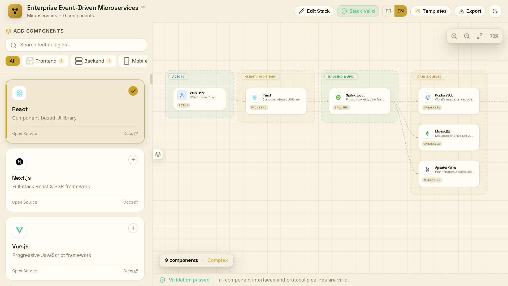

# Stack Architect

**Stop staring at a blank repo. Answer a few questions, get a real architecture.**

Stack Architect is a guided, step-by-step tech stack builder that turns what you're building into a clean, structured architecture diagram — frontend, backend, database, auth, payments, AI, infrastructure, and everything in between.

Choose your stack, understand how the pieces fit together, catch architectural gaps, and export the result. No backend. No API key. No account required.

---

## Demo

<p align="center">
  
</p>

---

## The problem

Starting a new project rarely begins with:

> "I know exactly what my architecture should look like."

It usually starts with something much simpler:

> "I want to build a SaaS application."

Then the questions start piling up:

- React or Next.js?
- FastAPI or NestJS?
- PostgreSQL or MongoDB?
- Do I actually need Redis?
- Where does authentication live?
- How does the frontend communicate with the backend?
- Where do payments fit?
- Do I need object storage?
- What changes if the application uses AI?
- What services are actually necessary?
- How do all these choices fit together?

The problem isn't a lack of technologies.

**It's the lack of a clear path from an idea to a coherent architecture.**

Most stack-building tools don't solve that.

They give you a giant list of technologies and ask you to pick everything at once. You end up choosing tools before understanding which layers your project actually needs.

Others generate a diagram from a prompt, but give you little control over the decisions behind it. The result can look impressive while hiding unnecessary services, missing dependencies, or questionable architectural choices.

And once you've finally made your choices, you're often left with nothing more than a list:

```text
React
FastAPI
PostgreSQL
Redis
Clerk
Stripe
S3
Gemini
```

But a list of technologies isn't an architecture.

**An architecture explains how those technologies work together.**


## The solution

Stack Architect asks one question at a time — what are you building, then layer by layer, what do you want to use for it — and adapts the layers it asks about to your project type. No AI key, no backend, no account. Pick your pieces, and get a clean, framed, exportable diagram at the end.

---

## ✨ Features

- 🧭 **Guided wizard, not a wall of checkboxes** — one layer at a time, in the right order, skippable when optional
- 🎯 **Smart layer recipes per project type** — a SaaS app asks about payments, an AI app asks about vector search, an API-only project skips the frontend entirely
- 🖼️ **Real brand logos** — powered by [simple-icons](https://github.com/simple-icons/simple-icons), not generic placeholder icons
- 🗺️ **Structured, framed diagrams** — every layer is boxed and labeled, connections are drawn automatically from your selections
- 📤 **Export everything** — Mermaid, C4/Structurizr DSL, Markdown ADR, raw JSON, and now **SVG & PNG images**
- 🩺 **Live architecture validation** — catches missing databases, redundant auth providers, or payment flows with no backend, with one-click fixes
- 🌗 **Light & dark themes**, built around a custom "blueprint ink & brass" visual identity — not another indigo SaaS template
- 🌍 **Bilingual out of the box** — English and French, with a token-based i18n system that's easy to extend
- ⚡ **Zero backend, zero secrets** — a static React + Vite app you can deploy anywhere in one command
- 📱 **Responsive** — the wizard, diagram canvas, and inspector all adapt down to mobile, including touch pan/pinch-zoom

---

## 🚀 Quick Start

```bash
git clone https://github.com/maimounadiallo4/StackArchitect.git
cd StackArchitect
npm install
npm run dev
```

Open `http://localhost:5173` and start building.

### Other commands

```bash
npm run build     # production build -> dist/
npm run preview   # serve the production build locally
npm run lint       # type-check the whole project
```

### Deploying

`npm run build` produces a fully static `dist/` folder — there is no server and no environment variables to configure. Drag it into Netlify, run `vercel --prod`, or push it to GitHub Pages / any static host of your choice.

---

## 🧱 Tech stack

| | |
|---|---|
| **Framework** | React 19 + TypeScript |
| **Build tool** | Vite 6 |
| **Styling** | Tailwind CSS v4 (CSS-first config) |
| **Icons** | [lucide-react](https://lucide.dev) for UI, [simple-icons](https://simpleicons.org) for real brand logos |

---

## 📁 Project structure

```
src/
├── components/
│   ├── wizard/        # The step-by-step builder (ProjectTypeStep, LayerStep, ExtrasStep...)
│   ├── ui/             # Small reusable primitives (Button, Modal, Sheet, Tabs...)
│   └── ...              # Diagram canvas, inspector, header, modals
├── engine/
│   ├── catalog.ts      # The technology database — this is where new tech gets added
│   ├── logos.ts         # Maps technology IDs to real simple-icons logos
│   ├── projectTypes.ts  # Project types + which layers the wizard asks about for each
│   ├── architectureEngine.ts  # Turns a tech selection into a laid-out node/edge graph
│   ├── validator.ts     # Architecture sanity checks (missing DB, duplicate auth, etc.)
│   ├── exporter.ts       # Mermaid / C4 / Markdown / JSON export
│   └── diagramImage.ts   # SVG generation + PNG rasterization for image export
├── i18n/                # Translation dictionary (English + French) and language context
└── types.ts              # Shared domain types
```

Want to add a new technology, a new layer, or a new project type? See [`CONTRIBUTING.md`](./CONTRIBUTING.md#-how-to-add-a-new-technology-or-layer) — it's a five-minute change.

---

## 🤝 Contributing

Contributions are genuinely welcome — see [`CONTRIBUTING.md`](./CONTRIBUTING.md) for the workflow, commit conventions, and a step-by-step guide to adding new technologies.

This project follows a [Code of Conduct](./CODE_OF_CONDUCT.md). By participating, you're expected to uphold it.

## 📄 License

MIT — see [`LICENSE`](./LICENSE) for details.
